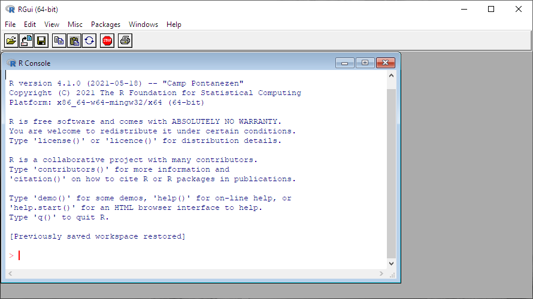
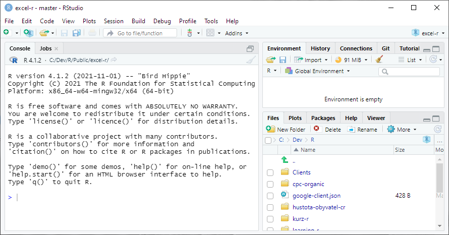
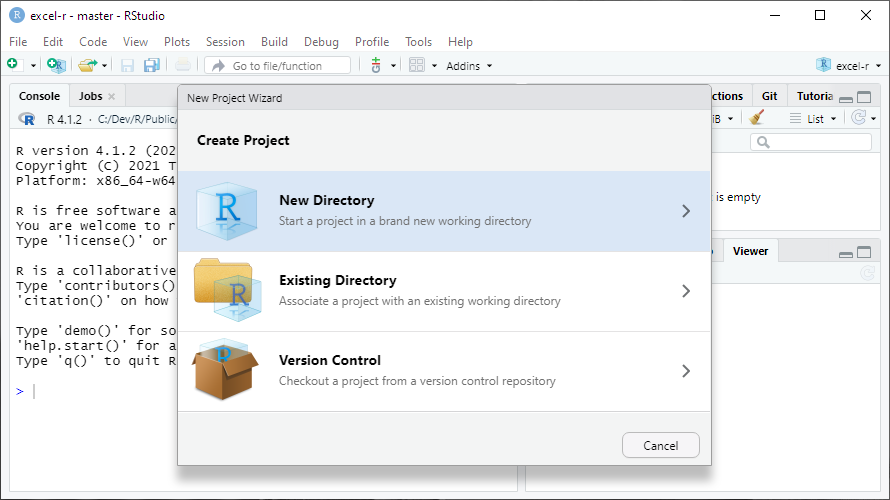
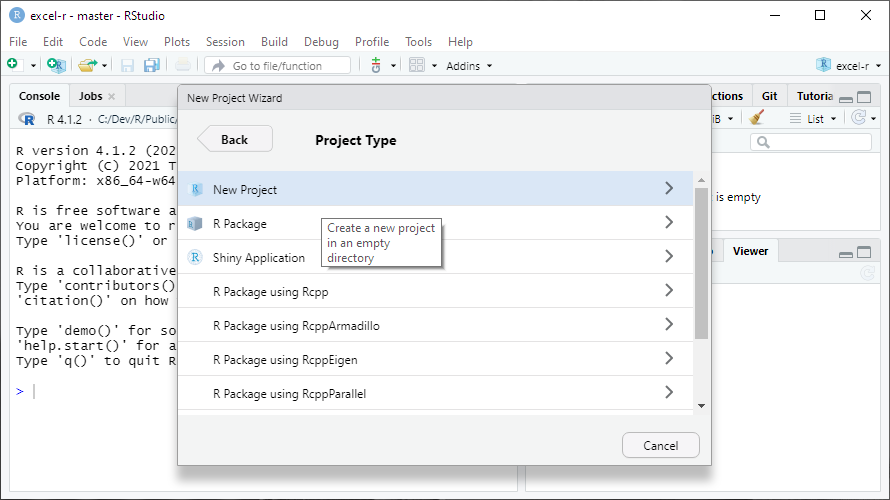
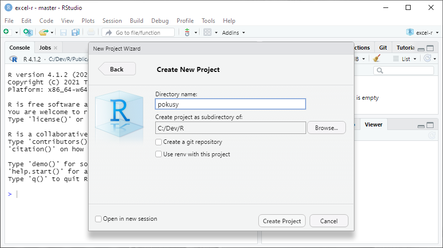
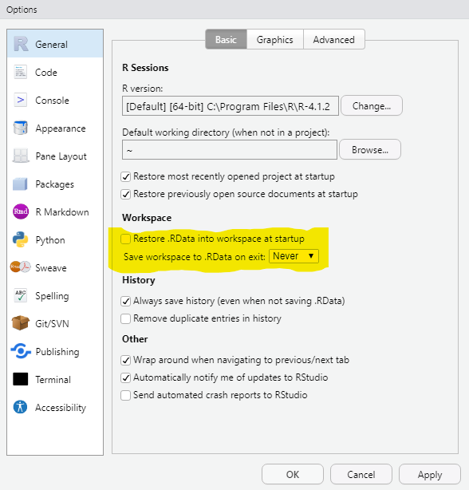
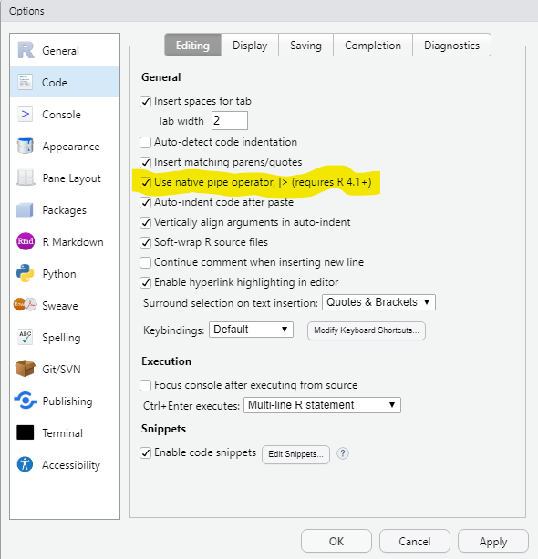
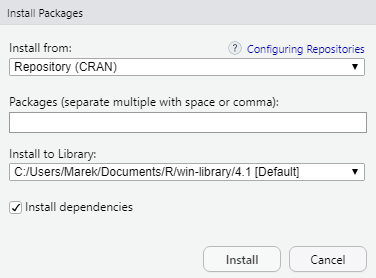

# Instalace a nastavení

Potřebujete dvě věci: samotné R, které je hodně spartánské a pracuje se v něm blbě, a RStudio, které je naopak super komfortní a když ho máte, do základního R už nikdy nevlezete.

## Cloud nebo instalace

Dobrá zpráva: pokud nechcete, nic si instalovat nemusíte. Pro první pokusy i pro vážnější práci můžete použít [RStudio.cloud](https://rstudio.cloud/), které běží v prohlížeči.

Život s ním budete mít o dost jednodušší, ale peněženku o něco prázdnější. RStudio.cloud sice má variantu zdarma, ale v té můžete pracovat maximálně 15 hodin měsíčně (za 5 USD 50 hodin měsíčně) a dostanete jen 1 GB RAM a 1 CPU, což není mnoho. Použitelná verze vás pak bude stát od 25 USD (small business) a dostanete 160 hodin měsíčně, až 8 GB RAM a až 4 CPU. Hodiny se ale násobí počtem CPU a velikostí RAM.

Jestli v cloudu pracovat nechcete, musíte nainstalovat jednak R a jednak RStudio. Obojí je snadné a zdarma. Pro vážnější práci budete časem potřebovat ještě Git. Ten je taky zdarma, ale rozchodit ho nemusí být úplně triviální.

**Moje doporučení:** jestli chcete R jen nezávazně vyzkoušet, zvlote cloud. Instalovat můžete kdykoli později.

## Instalace R

Stáhněte a nainstalujte si zkompilovanou verzi R pro svůj operační sytém z <https://cloud.r-project.org/>. Žádná past by tam být neměla, postupujte podle instrukcí na webu a v instalátoru.

Když po instalaci R spustíte, mělo by vypadat nějak takhle:



Okno zavřete a to je všechno. Odtěď můžete na základní R zapomenout.

## Instalace RStudia

Stáhněte a nainstalujte si RStudio Desktop z <https://www.rstudio.com/products/rstudio/download/>. I to by mělo jít bez problémů a spuštěné RStudio pak bude vypadat nějak takto:



## Pokud už R a RStudio máte (a trochu znáte)

Pro jistotu si zkontrolujte verzi RStudia i R. Verzi R vám řekne konsole při spuštění a kdykoli později ji zjistíte příkazem:

```{r}
R.version.string
```

Poslední verze (zjistíte [na webu R](https://www.r-project.org/)) je nejlepší, ale když budete o pár desetinek pozadu, nic vážného se nestane. On je upgrade R malinko opruz, takže ho nechcete dělat zbytečně. Rozhodně si ale aktualizujte nainstalované balíčky, protože to jde snadno příkazem:

```{r eval=FALSE}
update.packages(ask = FALSE, checkBuilt = TRUE)
```

Pokud byste měli starou verzi RStudia, jde ho normálně přeinstalovat.

## Založte si cvičný projekt

Tohle fakt hned teď udělejte. Je to důležité.

Po spuštění RStudia zvolte příkaz *New Project…* z menu *File*, nebo z roletky projektů vpravo nahoře. Na další obrazovce zvolte *New Directory*.



Na další *New Project*.



A nakonec zadejte název složky, ve které se má projekt vytvořit. Může to být výchozí (domovská) složka pro R (`~/R`) nebo jakákoli jiná, kterou si vytvoříte jako nadřízenou složku pro podložky eRkových projektů. Třeba u mě to je `c:/dev/R` (pro moje projekty), nebo `c:/dev/R/clients` (pro klientské projekty).



### Co jsou projekty

V RStudiu se nejčastěji pracuje v tzv. projektech. Jde to sice i bez nich, ale projekty jsou praktické, protože si pamatují různá nastavení, poslední otevřené soubory, historii příkazů apod. Na vašem počítači jeden projekt vždy odpovídá jedné složce (s případnými podsložkami), do které si RStudio uloží projektový soubor `nazev-projektu.Rproj`. Tímto souborem jde pak projekt otevřít např. z Průzkumníka Windows.

K projektům ještě pár doporučení a vysvětlení:

- V některých situacích vám zjednoduší život, když budete projekty pojmenovávat podobně jako webová URL, tj. jen písmeny malé anglické abecedy, čísly, pomlčkami a tečkami. Nutné to ale není.
- Po standardní instalaci vám na Windows (jinde to může být jiné) ve složce Dokumenty vznikne podsložka R, kterou pak RStudio (i samotné R) označuje aliasem `~/R`. Projekty ale můžete zakládat i jinde.
- Ať už si projekt založíte kdekoli, doporučuji si pro všechny projekty zvolit jedinou zastřešující složku, protože v různých kontextech se vám pak zobrazí jen název projektu, a pokud byste na více místech měli stejně pojmenované projekty, pletlo by vás to.
- Pokud máte nebo až budete mít zprovozněný Git, objeví se vám při volbě složky i volba *Create a git repository*. Vždycky ji zapínejte. Pro první pokusy ale Git nepotřebujete a já se mu v této knížce věnovat nebudu.

## Nastavení RStudia

R i RStudio je ve výchozím stavu nastaveno v zásadě dobře. Změňte prosím jen dvě věci.

Z menu *Tools* vyberte příkaz *Global Options…* (úplně na konci) a v následujícím dialogu vypněte volbu *Restore .RData into workspace at startup* a volbu *Save workspace to .RData on exit* nastavte na *Never*.



A pak na panelu *Code* zapněte volbu *Use native pipe operator*. To sice není nutné, ale vše se pak bude chovat stejně, jako v mých ukázkách.



## Instalace balíčků

Základní R je jenom jazykové jádro s nezbytnými příkazy a funkcemi. Jeho funkčnost rozšiřují tzv. balíčky (packages), kterým se v jiných jazycích často říká knihovny. Balíčky je potřeba jednak nainstalovat (jednorázově) a jednak připojit před konkrétní prací, ke které je potřebujete (vysvětlím později).

V RStudiu Desktop už jsou některé balíčky předinstalované a ještě víc jich je v cloudovém RStudio, ale pro jistotu vám ukážu, jak nainstalujete ty, které budete potřebovat pro celý tenhle seriál.

Z menu *Tools* zvolte příkaz *Install Packages…*. Objeví se tento dialog:



Nechte v něm předvyplněné volby a do prázdného políčka vložte tento seznam balíčků:

```
janitor, knitr, lubridate, rmarkdown, readxl, rvest, tidyverse
```

Alternativně jde balíčky instalovat funkcí `install.packages()`, kterou zavoláte třeba z konsole (vysvětlím za chvíli). To pak vypadá takhle:

```{r eval=FALSE}
install.packages(c("janitor", "knitr", "lubridate", "rmarkdown", "readxl", "rvest", "tidyverse"))
```

Oba způsoby balíčky zároveň aktualizují, což se občas hodí.
