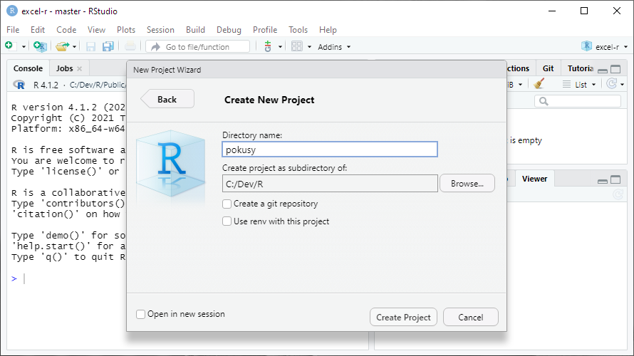
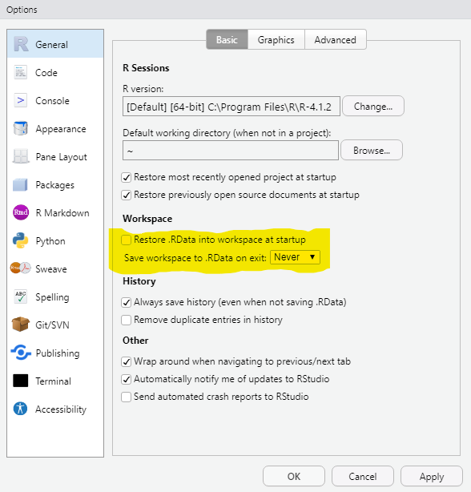
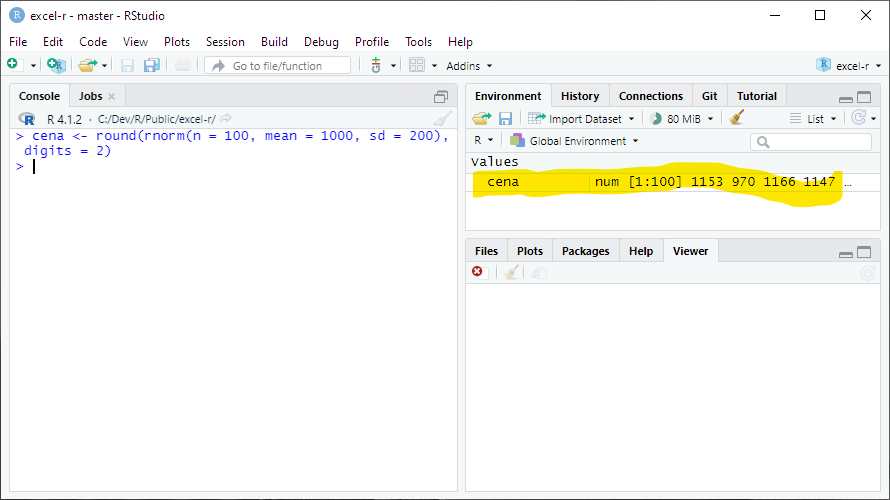

Instalace, nastavení a první krůčky v R
================
Marek Prokop
2022-03-11

## Instalace R a RStudia

Potřebujete dvě věci: samotné R, které je hodně spartánské a pracuje se
v něm blbě, a RStudio, které je naopak super komfortní a když ho máte,
do základního R už nikdy nevlezete.

### Cloud nebo instalace

Dobrá zpráva: pokud nechcete, nic si instalovat nemusíte. Pro první
pokusy i pro vážnější práci můžete použít
[RStudio.cloud](https://rstudio.cloud/), které běží v prohlížeči.

Život s ním budete mít o dost jednodušší, ale peněženku o něco
prázdnější. RStudio.cloud sice má variantu zdarma, ale v té můžete
pracovat maximálně 15 hodin měsíčně (za 5 USD 50 hodin měsíčně) a
dostanete jen 1 GB RAM a 1 CPU, což není mnoho. Použitelná verze vás pak
bude stát od 25 USD (small business) a dostanete 160 hodin měsíčně, až 8
GB RAM a až 4 CPU. Hodiny se ale násobí počtem CPU a velikostí RAM.

Jestli v cloudu pracovat nechcete, musíte nainstalovat jednak R a jednak
RStudio. Obojí je snadné a zdarma. Pro vážnější práci budete časem
potřebovat ještě Git. Ten je taky zdarma, ale rozchodit ho nemusí být
úplně triviální.

**Moje doporučení:** jestli chcete R jen nezávazně vyzkoušet, zvlote
cloud. Instalovat můžete kdykoli později.

### Instalace R

Stáhněte a nainstalujte si zkompilovanou verzi R pro svůj operační sytém
z
<a href="https://cloud.r-project.org/" class="uri">https://cloud.r-project.org/</a>.
Žádná past by tam být neměla, postupujte podle instrukcí na webu a v
instalátoru.

Když po instalaci R spustíte, mělo by vypadat nějak takhle:


Okno zavřete a to je všechno. Odtěď můžete na základní R zapomenout.

### Instalace RStudia

Stáhněte a nainstalujte si RStudio Desktop z
<a href="https://www.rstudio.com/products/rstudio/download/" class="uri">https://www.rstudio.com/products/rstudio/download/</a>.
I to by mělo jít bez problémů a spuštěné RStudio pak bude vypadat nějak
takto:


### Pokud už R a RStudio máte (a trochu znáte)

Pro jistotu si zkontrolujte verzi RStudia i R. Verzi R vám řekne konsole
při spuštění a kdykoli později ji zjistíte příkazem:

``` r
R.version.string
```

    ## [1] "R version 4.1.2 (2021-11-01)"

Poslední verze (zjistíte [na webu R](https://www.r-project.org/)) je
nejlepší, ale když budete o pár desetinek pozadu, nic vážného se
nestane. On je upgrade R malinko opruz, takže ho nechcete dělat
zbytečně. Rozhodně si ale aktualizujte nainstalované balíčky, protože to
jde snadno příkazem:

``` r
update.packages(ask = FALSE, checkBuilt = TRUE)
```

Pokud byste měli starou verzi RStudia, jde ho normálně přeinstalovat.

## Založte si cvičný projekt

Tohle fakt hned teď udělejte. Je to důležité.

Po spuštění RStudia zvolte příkaz *New Project…* z menu *File*, nebo z
roletky projektů vpravo nahoře. Na další obrazovce zvolte *New
Directory*.


Na další *New Project*.


A nakonec zadejte název složky, ve které se má projekt vytvořit. Může to
být výchozí (domovská) složka pro R (\~/R) nebo jakákoli jiná, kterou si
vytvoříte jako nadřízenou složku pro podložky eRkových projektů. Třeba u
mě to je `c:/dev/R` (pro moje projekty), nebo `c:/dev/R/clients` (pro
klientské projekty).



### Co jsou projekty

V RStudiu se nejčastěji pracuje v tzv. projektech. Jde to sice i bez
nich, ale projekty jsou praktické, protože si pamatují různá nastavení,
poslední otevřené soubory, historii příkazů apod. Na vašem počítači
jeden projekt vždy odpovídá jedné složce (s případnými podsložkami), do
které si RStudio uloží projektový soubor `nazev-projektu.Rproj`. Tímto
souborem jde pak projekt otevřít např. z Průzkumníka Windows.

K projektům ještě pár doporučení a vysvětlení:

-   V některých situacích vám zjednoduší život, když budete projekty
    pojmenovávat podobně jako webová URL, tj. jen písmeny malé anglické
    abecedy, čísly, pomlčkami a tečkami. Nutné to ale není.
-   Po standardní instalaci vám na Windows (jinde to může být jiné) ve
    složce Dokumenty vznikne podsložka R, kterou pak RStudio (i
    samotné R) označuje aliasem \~/R. Projekty ale můžete zakládat i
    jinde.
-   Ať už si projekt založíte kdekoli, doporučuji si pro všechny
    projekty zvolit jedinou zastřešující složku, protože v různých
    kontextech se vám pak zobrazí jen název projektu, a pokud byste na
    více místech měli stejně pojmenované projekty, pletlo by vás to.
-   Pokud máte nebo až budete mít zprovozněný Git, objeví se vám při
    volbě složky i volba *Create a git repository*. Vždycky ji
    zapínejte. Pro první pokusy ale Git nepotřebujete.

## Nastavení RStudia

R i RStudio je ve výchozím stavu nastaveno v zásadě dobře. Změňte prosím
jen dvě věci.

Z menu *Tools* vyberte příkaz *Global Options…* (úplně na konci) a v
následujícím dialogu vypněte volbu *Restore .RData into workspace at
startup* a volbu *Save workspace to .RData on exit* nastavte na *Never*.



A pak na panelu *Code* zapněte volbu *Use native pipe operator*. To sice
není nutné, ale vše se pak bude chovat stejně, jako v mých ukázkách.


## Instalace balíčků

Základní R je jenom jazykové jádro s nezbytnými příkazy a funkcemi. Jeho
funkčnost rozšiřují tzv. balíčky (packages), kterým se v jiných jazycích
často říká knihovny. Balíčky je potřeba jednak nainstalovat
(jednorázově) a jednak připojit před konkrétní prací, ke které je
potřebujete (vysvětlím později).

V RStudiu Desktop už jsou některé balíčky předinstalované a ještě víc
jich je v cloudovém RStudio, ale pro jistotu vám ukážu, jak
nainstalujete ty, které budete potřebovat pro celý tenhle seriál.

Z menu *Tools* zvolte příkaz *Install Packages…*. Objeví se tento
dialog:


Nechte v něm předvyplněné volby a do prázdného políčka vložte tento
seznam balíčků:

    janitor, knitr, lubridate, rmarkdown, readxl, rvest, tidyverse

Alternativně jde balíčky instalovat funkcí `install.packages()`, kterou
zavoláte třeba z konsole (vysvětlím za chvíli). To pak vypadá takhle:

``` r
install.packages(c("janitor", "knitr", "lubridate", "rmarkdown", "readxl", "rvest", "tidyverse"))
```

Oba způsoby balíčky zároveň aktualizují, což se občas hodí.

## Tři způsoby práce s R

S R jde pracovat mnoha různými způsoby. Já nejčastěji používám tři:

1.  Interaktivní práce v konsoli.
2.  Polointeraktivní práce se skriptem.
3.  Interaktivní, poloautomatická či zcela automatická tvorba dokumentu
    v R Markdownu.

Všechny tři ukážu na jednoduchém příkladu: představte si, že jste dnes
ve svém obchodě vydali 100 účtenek. Teď se chcete rychle dozvědět, kolik
dělá celková tržba a jaká byla typická útrata jednoho zákazníka.

### Interaktivní práce s konsolí

Vaše RStudio vypadá nějak takhle a konsole je ta velká plocha vlevo.
Psát budete za zobáček úplně vlevo (jinam ani nejde umístit kursor),
každý řádek vždy odentrujete a konsole vám většinou nějak odpoví.


Nejprve si vygenerujte účtenky. Budou sice trochu falešné, ale to
nevadí. Do konsole napište:

``` r
cena <- round(rnorm(n = 100, mean = 1000, sd = 200), digits = 2)
```

Odentrujte a nic se nestane. Vlastně stane. Pokud se podíváte doprava na
záložku *Environment*, uvidíte tam tohle:



Příkazem jste totiž vytvořili v prostředí R (environment) nový objekt
`cena` a uložili jste do něj sto (skoro) náhodných čísel. Na všechny se
můžete podívat příkazem:

``` r
cena
```

    ##   [1]  868.66 1065.17  950.95 1132.59  618.77 1071.35 1252.54  851.77 1259.05
    ##  [10]  857.93 1271.39  880.25 1237.23  894.43  990.10  880.02 1153.93 1189.04
    ##  [19] 1154.11 1096.46  850.92 1083.98  878.40  924.05  687.48  801.12  945.62
    ##  [28] 1250.12  954.10  737.04  867.54  986.84  996.49  935.94  755.72  867.62
    ##  [37]  948.47  949.85  903.09  867.82  927.50 1123.59  811.87 1243.45 1311.91
    ##  [46] 1079.97 1066.94 1305.80  866.37  930.37  874.23 1029.76 1294.87  865.60
    ##  [55]  815.86  792.45 1044.45 1144.97 1286.52 1298.24  844.13 1278.55 1016.13
    ##  [64] 1156.59 1047.09 1525.72 1074.84  626.13  800.66 1253.31 1165.31  746.70
    ##  [73]  985.04 1223.93 1135.86 1273.74 1031.54  908.30  837.25  983.63  981.10
    ##  [82]  846.64 1207.96  810.28 1008.75 1212.15  957.05 1176.08 1205.70 1095.59
    ##  [91]  858.08 1291.89 1128.25  967.66  714.45 1070.04 1200.80  885.69 1031.42
    ## [100]  833.83

což pak na konsoli vypadá nějak takhle:


Teď vám to ale musím vysvětlit trochu podrobněji.

#### Objekty (proměnné)

Objekt jazyka R se chová podobně jako proměnná v jiných programovacích
jazycích. Je to vlastně takový šuplík, do kterého si můžete ukládat
nejrůznější hodnoty: čísla, textové řetězce, logické hodnoty (TRUE a
FALSE čili pravda a nepravda) apod.

Oproti jiným programovacím jazykům je tu pár zvláštností:

-   Do objektů se přiřazuje znaky `<-` ale můžete si to zjednodušit
    klávesovou zkratkou <kbd>Alt</kbd>+<kbd>-</kbd> (Alt pomlčka).
-   Běžné objekty R jsou ve skutečnosti vektory. V jiných programovacích
    jazycích tomu obvykle odpovídá jednorozměrné pole. V praxi to
    znamená, že v číselném objektu nemusí být jen jedno číslo, ale může
    jich tam být moc. V našem příkladu jich je sto.
-   R s vektory automaticky i počítá. K vektoru pěti čísel tedy můžete
    přičíst jedno číslo (ve skutečnosti vektor s jedním číslem) a ono se
    automaticky přičte ke všem pěti.

Kde se nám tam těch sto čísel vzalo? Získali jsme je funkcemi rnorm a
round.

#### Funkce

Poučka praví, že když to existuje, je to objekt, a když to něco dělá, je
to funkce. Můžete to brát i tak, že funkce je všechno, co má za svým
jménem kulaté závorky. V závorkách mohou být tzv. parametry (někdy se
jim říká argumenty; je to totéž), čili vstupní data, která chcete funkci
předat. Funkce tyto parametry nějak zpracuje a vrátí výsledek. Vlastně
úplně stejně, jako funkce v Excelu.

U názvů objektů i funkcí záleží na velikosti písmen. `Cena` je něco
jiného než `cena`, tak pozor na to.

`rnorm` je funkce, která vrací (skoro) náhodná čísla. Skoro jsem dal do
závorky, protože vrácená čísla jsou náhodná v rámci normálního rozdělení
(to je ta slavná Gaussova křivka), jehož podobu určíte parametry `mean`
(průměr) a `sd` (směrodatná odchylka neboli standard deviation).
Parametrem `n` navíc musíte určit, kolik těch čísel vlastně chcete.

Následující příkaz tedy vrátí vektor sta náhodných čísel z normální
rozdělení s průměrem 1000 a směrodatnou odchylkou 200.

``` r
rnorm(n = 100, mean = 1000, sd = 200)
```

    ##   [1] 1017.3953 1292.4241 1325.1267  744.5328  735.7628 1051.9968 1236.3737
    ##   [8]  679.2080  902.0179  721.8360  993.1419 1085.1381 1129.5588 1260.2962
    ##  [15] 1087.4164  591.5358 1019.7038  740.4228  657.3230  918.1022 1002.5318
    ##  [22]  965.1981  922.6366 1111.0184  943.3995  933.8985  746.5726  754.2213
    ##  [29]  959.4765 1143.4445  827.5805 1112.3330  894.9344 1028.7627 1160.6042
    ##  [36] 1150.3738  882.8844  954.1935  870.1194 1172.7959 1089.1231 1082.5739
    ##  [43] 1113.0876 1048.6723 1345.2913 1283.7267 1387.9632  791.7166  987.0641
    ##  [50] 1630.1305  994.8527 1241.0016 1361.1966 1119.7761 1027.6684  972.1470
    ##  [57]  879.9076  966.3991 1075.3375 1198.4934  700.1928  965.7467  718.6874
    ##  [64] 1120.1110  804.3593 1028.2259 1299.2998  828.7481 1051.2224 1142.0059
    ##  [71] 1200.5311 1369.4755  862.8442 1109.1774 1001.5171  769.5887  993.8900
    ##  [78]  789.2463  924.1351  864.0898  980.7796  794.3113 1131.9354 1205.1325
    ##  [85]  829.2894 1142.1873 1016.9642 1057.5782  691.9106 1081.5839 1109.9727
    ##  [92] 1063.0000  603.9179  806.8270 1066.8117  863.8399 1253.7145 1069.6127
    ##  [99] 1064.6997  745.5937

Klidně si ho zadejte párkrát do konzole s různými parametry, abyste
viděli, jak se mění výsledek.

\`round\`\` je funkce, která zaokrouhluje. První parametr je číselný
vektor, který se má zaokrouhlit, a druhý parametr digits určuje, na
kolik desetinných míst se má zaokrouhlit. Následující příkaz tedy
zaokrouhlí číslo 1.145 na dvě desetinná místa:

``` r
round(1.145, digits = 2)
```

    ## [1] 1.15

První parametr funkce `round` se jmenuje `x`, ale první parametr funkce
se často píše bez jména, protože jeho pořadí nejde poplést. Každopádně
ale může napsat volání funkce i takto a výsledk bude stejný:

``` r
round(x = 1.145, digits = 2)
```

    ## [1] 1.15

A teď už asi chápete – funkce `rnorm` vrátí sto čísel s hodně
desetinnými čísly, a proto jste její výsledek ještě poslali funkci
`round`, která celý vektor (tj. všech sto čísel) zaokrouhlila na dvě
desetinná místa. V jiném programovacím jazyce byste na to potřebovali
dost složité výpočty v cyklech, v R stačí tohle:

``` r
round(rnorm(n = 100, mean = 1000, sd = 200), digits = 2)
```

    ##   [1]  986.55 1112.54 1181.13  758.04 1072.11  952.86  891.50 1219.13  860.26
    ##  [10] 1064.07  960.38 1095.63 1088.72 1031.29 1153.31  788.41 1024.13  945.66
    ##  [19]  915.47 1072.63  762.39 1006.97 1082.74  893.60 1049.16  843.15  859.89
    ##  [28]  619.10  751.57 1071.08  885.34 1008.05 1040.84 1108.25  938.35  921.96
    ##  [37] 1070.24 1131.16 1006.97  884.05  958.65  474.61 1289.45  745.00 1200.92
    ##  [46]  925.01  788.17 1157.38  870.49  906.87 1190.17 1144.11 1046.67  642.99
    ##  [55] 1006.73  925.71  785.91  613.82 1203.41  986.06  864.56  950.66 1063.51
    ##  [64]  930.69  647.66  955.56  859.70 1078.94 1390.47 1341.12  899.29 1028.60
    ##  [73]  800.05 1121.55  254.51 1080.99 1080.86  966.11  643.87 1018.05  888.41
    ##  [82] 1001.78 1062.11  855.68 1154.41 1146.13  690.05 1335.84  950.13 1191.77
    ##  [91] 1343.09 1003.56 1210.02 1071.17 1025.01  366.81 1114.42 1022.19 1086.09
    ## [100]  805.44

Mimochodem, všimli jste si v předešlých příkladech těch čísel v
hranatých závorkách? Protože se v příkladech vypisují jako výsledky
vektory (všechny základní, tzv. atomické typy jsou v R vektory), R vám
těmi čísly v hranatých závorkách říká, na jaké pozici ve vektoru daná
hodnota je.

A hranaté závorky jdou i použít pro adresování konkrétního prvku
vektoru. Třeba tohle zobrazí z vytvořeného vektoru `cena` jenom pátý
prvek:

``` r
cena[5]
```

    ## [1] 618.77

a tohle pátý až desátý:

``` r
cena[5:10]
```

    ## [1]  618.77 1071.35 1252.54  851.77 1259.05  857.93

Chtěli jsme ještě účtenky sečíst, že? Je to hračka:

``` r
sum(cena)
```

    ## [1] 101380.5

Zajímá vás, kolik dělá celková tržba bez DPH?

``` r
sum(cena / 121 * 100)
```

    ## [1] 83785.56

případně:

``` r
sum(cena) / 121 * 100
```

    ## [1] 83785.56

Obojí by vám mělo dát stejný výsledek. V prvním případě se ale nejprve
vydělí každý jednotlivý prvek vektoru a pak se celý vektor sečte, kdežto
v druhém případě se celý vektor nejprve sečte a pak teprve vydělí.

Zajímá vás rozložení ceny zobrazené v histogramu?

``` r
hist(cena)
```

<!-- -->

Zobrazí se vám na panelu *Plot* vpravo (váš bude vypadat trochu jinak).

Tím jste poznali další dvě funkce (`sum` a `hist`). Teď vám ukážu, jak
totéž udělat skriptem a v R Markdown.

### Práce se skripty

Práce v konsoli je sice flexibilní, ale na víc než pár příkazů dost
nepraktická. Když uděláte chybu, můžete se sice šipkami nahoru a dolů
pohybovat po historii příkazů a opravovat je, ale není to ono. Chyby se
mnohem lépe opravují ve skriptech.

Z menu *File → New File* vyberte *R Script* a vlevo nahoře se vám otevře
editor skriptů. Do něj si vložte všechny příkazy, které jste předtím
zadali postupně do konsole. Nemusíte to ale dělat ručně – podívejte se
vpravo na záložku History a vida, jsou tam, že? Vyberte ty správné a
tlačítkem To Source je přesuňte do skriptu. Okno RStudia by pam mělo
vypadat nějak takto:


Když nyní na kterémkoli řádku stisknete
<kbd>Ctrl</kbd>+<kbd>Enter</kbd>, celý řádek se vykoná stejně, jako
kdybyste ho zadali na konzoli. Můžete i klávesou Shift vybrat víc řádků
a pak se po <kbd>Ctrl</kbd>+<kbd>Enter</kbd> vykonají všechny. A konečně
můžete tlačítkem *Source* nad editorem vykonat celý skript. Po vykonání
celého skriptu by mělo okno RStudia vypadat nějak takto:


Nezapomeňte si ale celý skript uložit pod nějakým vhodným jménem (třeba
`prvni-skript`). Měl by se vám uložit do složky projektu a ke jménu se
automaticky připojí přípona R.

#### Úprava skriptu

Hlavní výhoda skriptu spočívá v tom, že jde snadno upravit a pak celý
znovu spustit. Vyzkoušejte si to. Hned v prvním řádku změňte `rnorm` za
`runif` a odstraňte této funkci parametry `mean` a `sd`, takže zbude jen
`n`.

``` r
cena <- round(runif(n = 100), digits = 2)
```

Když teď celý skript znovu sputíte příkazem *Source* (nebo klávesovou
zkratkou <kbd>Ctrl</kbd>+<kbd>Shift</kbd>+<kbd>S</kbd>), poznáte, co se
změnilo?

``` r
hist(cena)
```

<!-- -->

Ano, změnil se histogram.

Funkce `rnorm` totiž vybírá náhodná čísla z normálního rozložení
(**r**andom **norm**al distribution) a histogram má proto tvar známe
gaussovy křivky – čísla blíže průměru se vyskytnou pravděpodobněji než
čísla dál od průměru. Funkce `runif` (**r**andom **unif**orm
distribution) naproti tomu vybírá náhodná čísla z rovnoměrného
rozdělení, takže pravděpodobnost zastoupení všech čísel mezi nulou a
jednou je stejná.

### R Markdown

Skripty jsou praktické, ale mají dvě nevýhody:

-   Když nechcete provést celý skript najednou, špatně se v nich hledá
    část, kterou chcete spustit.
-   Výstup není moc přehledný. Textový výstup se ne moc hezky zobrazí v
    konzoli, grafy na panelu *Plots*.

Obě tyto nevýhody odstraňuje R Markdown.

#### Co je R Markdown

##### Základní Markdown

Samotný [Markdown](https://cs.wikipedia.org/wiki/Markdown) možná znáte.
Je to jednoduchý značkovací jazyk, kterým jdou v čistě textovém formátu
vyznačit základní strukturání a formátovací prvky – nadpisy, odstavce,
odrážky, odkazy, tučný text apod. Z toho pak jde vygenerovat výstupy v
různých formátech: nejčastěji v HTML, ale klidně i PDF, Word atd.

Text v Markdownu vypadá např. takto:

``` markdown
# Tohle je nadpis 1. úrovně

Tohle je běžný odstavec. Víc odstavců je od sebe odděleno dvěma Entry čili prázdným řádkem.

## Tohle je nadpis 2. úrovně

Tohle je příklad [odkazu v textu](https://example.com). A tohle je příklad odrážek:

- první odražka,
- druhé odrážka,
- třetí odrážka.

Jdou udělat i číslované body, které se automaticky očíslují podle pořadí:

1. První bod.
1. Druhý bod.
1. Poslední bod.
```

Jak vidíte, docela dobře se píše a dobře se i čte, i když není převedený
(vyrenderovaný) do HTML. Ale když se převede, je to výsledek docela
hezký:


##### R Markdown

R Mardown je Markdown, do kterého jsou zamíchané kusy eRkového kódu.
Vypadá nějak takhle:


Vyzkoušejte si nyní R Markdown sami. Nejprve si založte nový soubor: Z
menu *File → New File* vyberte *R Notebook*. Objeví se vám editor s
předvyplněným vzorovým obsahem. Ten celý zrušte (Ctrl+A, Del) a
zkopírujte do něj tohle:

```` markdown
---
title: "Můj první R Notebook"
output: html_notebook
---

Toto je příklad [R Markdown](http://rmarkdown.rstudio.com) zápisníku (notebook). Začíná nahoře metadaty, které zde udávají jen titulek a formát výstupu. Metadata jsou ohraničena řádky tvořenými třemi pomlčkami. Pak následuje normální Markdown.

Za tímto odstavcem je blok eRkového kódu, kterému se říká *chunk* a já mu budu říkat *blok*.

```{r}
cena <- round(rnorm(n = 100, mean = 1000, sd = 200), digits = 2)
sum(cena)
```

Pokud blok spustíte zelenou šipečkou na jeho pravém horním okraji nebo klávesovou zkratkou Ctrl+Shift+Enter, provede se a zobrazí výstup přímo pod sebou.
````

Výsledek bude vypadt jako na předešlém obrázku. Nyní můžete podle
instrukcí vykonat jediný blok kódu, který tam zatím máte, a pod blkoem
se vám zobrazí součet ceny.

A můžete i celý soubor převést do HTML a prohládnout si ho v celé kráse.
Uděláte to příkazem *Preview* z toolbaru nad editorem, ale před tím
ještě musíte soubor uložit, třeba pod jménem `prvni-notebook`. Ke jménu
se automaticky připojí přípona Rmd.

Celý výsledek se zobrazí v panelu *Viewer* vpravo:


Už jste pochopili, v čem jsem napsal tenhle článek? Ano, v RStudiu v R
Markdownu :-)

Ze všech tří způsobů používání R (konzole, skripty, R Markdown) používám
R Markdown pro běžné analýzy nejčastěji. Píšu si v něm postup, eRkový
kód i poučení z výsledků. Když se pak později k analýze vrátím, třeba
proto, že chci pro jiného klienta udělat nějakou podobnou, krásně vidím,
jak jsem postupoval a co a proč jsem udělal. Už tohle je pro mě obrovská
výhoda oproti excelové tabulce, ve které se už po pár týdnech nevyznám a
musím znovu pracně zkoumat, co tam je, proč to tam a jak to vlastně
funguje.

A totéž doporučuji i vám: klidně pro teď zapoměňte, že nějaká konzole a
skripty vůbec existují a používejte na všechno R Markdown.

## Co jste se naučili
