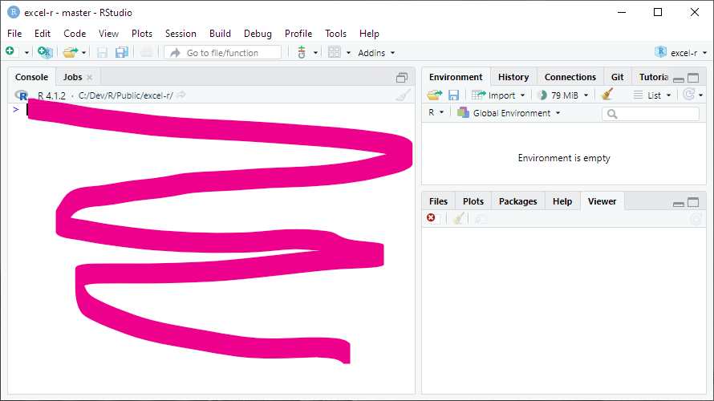
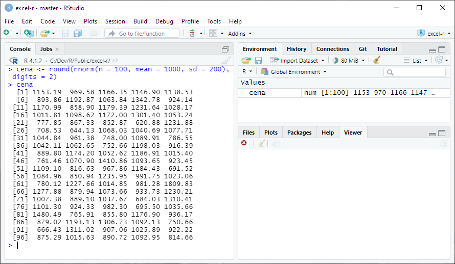
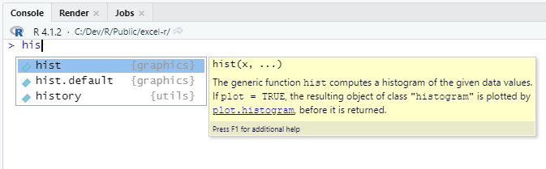
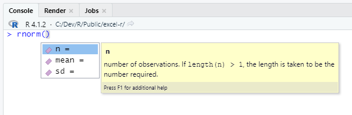
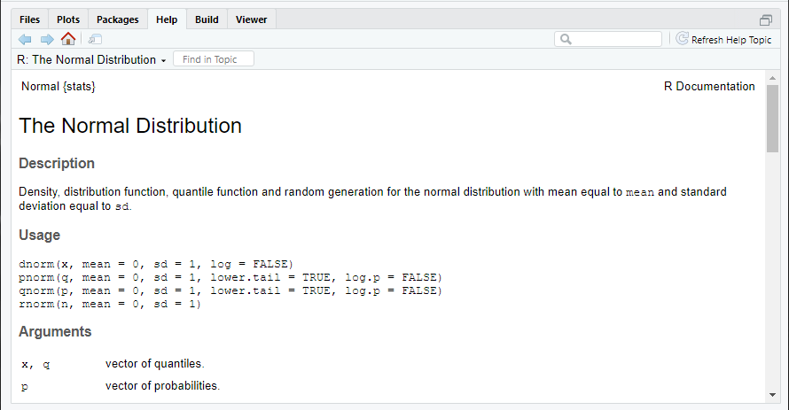
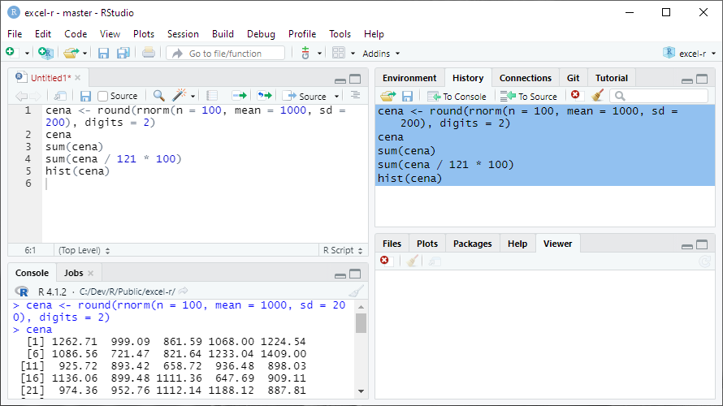
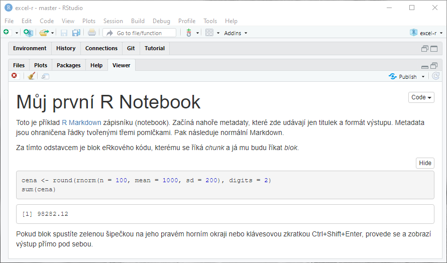

# První kroky v R a RStudiu

Nebudu vám tajit, že se způsob práce v R od Excelu na první pohled dost liší. Excel vám naservíruje připravený rastr buněk, do kterých můžete rovnou psát hodnoty a vzorce. V R naopak začínáte s prázdnou plochou, a co si sami neuděláte, to nemáte.

## Excel vs. R

Když chcete v Excelu sečíst dvě čísla ve dvou různých buňkách, nejprve je do těch buněk napíšete. Např. číslo 10 do buňky A1 a číslo 20 do buňky B1. Do buňky C1 pak můžete dát vzorec `=A1+B1`, který čísla sečte.

V R to uděláte podobně jen musíte napsat kód, který „buňky" (v R se jim říká objekty) založí a pak sečte. Ten kód může vypadat třeba takhle:

```{r}
prvni_cislo <- 10
druhe_cislo <- 20
prvni_cislo + druhe_cislo
```

Případně můžete, stejně jako v Excelu, dvě čísla rovnou sečíst:

```{r}
10 + 20
```

A nebo výsledek uložit do jiné „buňky" (objektu):

```{r}
prvni_cislo <- 10
druhe_cislo <- 20
vysledek <- prvni_cislo + druhe_cislo
```

a tu si pak zobrazit:

```{r}
vysledek
```

Ve skutečnosti je to o dost pestřejší. Můžete jedním „vzorcem" (v R se tomu říká výraz nebo příkaz) zpracovat celou řadu nebo tabulku různých hodnot a výsledek zobrazit mnoha způsoby -- jako tabulku, formátovaný text, graf. To vše se v této knížce naučíte.

## Tři způsoby práce s R

S R jde pracovat více různými způsoby. Já nejčastěji používám tři:

1.  Interaktivní práce v konzoli.
2.  Polointeraktivní práce se skriptem.
3.  Interaktivní, poloautomatická či zcela automatická tvorba dokumentu v R Markdownu.

Všechny tři ukážu na jednoduchém příkladu: představte si, že jste dnes ve svém obchodě vydali 100 účtenek. Teď se chcete rychle dozvědět, kolik dělá celková tržba a jaká byla typická útrata jednoho zákazníka.

## Interaktivní práce s konzolí

Vaše RStudio vypadá nějak takhle a konzole je ta velká plocha vlevo. Psát budete za zobáček úplně vlevo (jinam ani nejde umístit kursor), každý řádek vždy odentrujete a konzole vám většinou nějak odpoví.



Nejprve si vygenerujte účtenky. Budou sice trochu falešné, ale to nevadí. Do konzole napište:

```{r}
cena <- round(rnorm(n = 100, mean = 1000, sd = 200), digits = 2)
```

Odentrujte a nic se nestane. Vlastně stane. Pokud se podíváte doprava na záložku *Environment*, uvidíte tam tohle:


Příkazem jste totiž vytvořili v prostředí R (environment) nový objekt `cena` a uložili jste do něj sto (skoro) náhodných čísel. Na všechny se můžete podívat příkazem:

```{r}
cena
```

což pak na konzoli vypadá nějak takhle (čísla jsou náhodná, takže nesedí s předešlým výsledkem):



Teď vám to ale musím vysvětlit trochu podrobněji.

### Objekty (proměnné)

Objekt jazyka R se chová podobně jako proměnná v jiných programovacích jazycích. Je to vlastně takový šuplík, do kterého si můžete ukládat nejrůznější hodnoty: čísla, textové řetězce, logické hodnoty (TRUE a FALSE čili pravda a nepravda) apod.

Oproti jiným programovacím jazykům je tu pár zvláštností:

-   Do objektů se hodnoty přiřazují operátorem `<-`. Ten můžete vložit i klávesovou zkratkou <kbd>Alt</kbd>+<kbd>-</kbd> (Alt pomlčka).
-   Běžné objekty R jsou ve skutečnosti vektory. V jiných programovacích jazycích tomu obvykle odpovídá jednorozměrné pole. V praxi to znamená, že v číselném objektu nemusí být jen jedno číslo, ale může jich tam být moc. V našem příkladu jich je sto.
-   R s vektory automaticky i počítá. K vektoru pěti čísel tedy můžete přičíst jedno číslo (ve skutečnosti vektor s jedním číslem) a ono se automaticky přičte ke všem pěti. Později na to ukážu další příklady.

Kde se vám tam těch sto čísel vzalo? Získali jste je funkcemi `rnorm` a `round`.

### Funkce

Poučka praví: když to existuje, je to objekt, a když to něco dělá, je to funkce. Můžete to brát i tak, že funkce je všechno, co má za svým jménem kulaté závorky. V závorkách mohou být tzv. parametry (někdy se jim říká argumenty; je to totéž), čili vstupní data, která chcete funkci předat. Funkce tyto parametry zpracuje a vrátí výsledek. Vlastně úplně stejně, jako funkce v Excelu.

U názvů objektů i funkcí záleží na velikosti písmen. `Cena` je něco jiného než `cena`, tak pozor na to.

`rnorm` je funkce, která vrací (skoro) náhodná čísla. Skoro jsem dal do závorky, protože vrácená čísla jsou náhodná v rámci normálního rozdělení (to je ta slavná Gaussova křivka), jehož podobu určíte parametry `mean` (průměr) a `sd` (směrodatná odchylka neboli standard deviation). Parametrem `n` navíc musíte určit, kolik těch čísel vlastně chcete.

Následující příkaz tedy vrátí vektor sta náhodných čísel z normální rozdělení s průměrem 1000 a směrodatnou odchylkou 200.

```{r}
rnorm(n = 100, mean = 1000, sd = 200)
```

Klidně si ho zadejte párkrát do konzole s různými parametry, abyste viděli, jak se mění výsledek.

`round` je funkce, která zaokrouhluje. První parametr je číselný vektor, který se má zaokrouhlit, a druhý parametr digits určuje, na kolik desetinných míst se má zaokrouhlit. Následující příkaz tedy zaokrouhlí číslo 1.145 na dvě desetinná místa:

```{r}
round(1.145, digits = 2)
```

První parametr funkce `round` se jmenuje `x`, ale první parametr funkce se často píše bez jména, protože jeho pořadí nejde poplést. Každopádně ale může napsat volání funkce i takto a výsledek bude stejný:

```{r}
round(x = 1.145, digits = 2)
```

A teď už asi chápete -- funkce `rnorm` vrátí sto čísel s hodně desetinnými čísly, a proto jste její výsledek ještě poslali funkci `round`, která celý vektor (tj. všech sto čísel) zaokrouhlila na dvě desetinná místa. V jiném programovacím jazyce byste na to potřebovali dost složité výpočty v cyklech, v R stačí tohle:

```{r}
round(rnorm(n = 100, mean = 1000, sd = 200), digits = 2)
```

Mimochodem, všimli jste si v předešlých příkladech těch čísel v hranatých závorkách? Protože se v příkladech vypisují jako výsledky vektory (všechny základní, tzv. atomické typy jsou v R vektory), R vám těmi čísly v hranatých závorkách říká, na jaké pozici ve vektoru daná hodnota je.

A hranaté závorky jdou i použít pro adresování konkrétního prvku vektoru. Třeba tohle zobrazí z vytvořeného vektoru `cena` jenom pátý prvek:

```{r}
cena[5]
```

a tohle pátý až desátý:

```{r}
cena[5:10]
```

Chtěli jsme ještě účtenky sečíst, že? Je to hračka:

```{r}
sum(cena)
```

Zajímá vás, kolik dělá celková tržba bez DPH?

```{r}
sum(cena / 121 * 100)
```

případně:

```{r}
sum(cena) / 121 * 100
```

Obojí by vám mělo dát stejný výsledek. V prvním případě se ale nejprve vydělí každý jednotlivý prvek vektoru a pak se celý vektor sečte, kdežto v druhém případě se celý vektor nejprve sečte a pak teprve vydělí.

Zajímá vás rozložení ceny zobrazené v histogramu?

```{r}
hist(cena)
```

Zobrazí se vám na panelu *Plot* vpravo (váš bude vypadat trochu jinak).

Tím jste poznali další dvě funkce (`sum` a `hist`). Za chvíli vám ukážu, jak totéž udělat skriptem a v R Markdownu, ale nejdřív pár slov k nápovědě.

### Integrovaná nápověda

R má přímo v sobě zabudovanou nápovědu ke každé funkci. Ta se projevuje jednak tím, že když začnete psát název funkce, po pár znacích se začnou nabízet funkce, jejichž název těmi znaky začíná a v bublině se objeví stručný popis. Tuto nápovědu lze případně vynutit klávesovou kombinací <kbd>Ctrl</kbd>+<kbd>Space</kbd>.



Pokud máte funkci napsanou i se závorkami, <kbd>Ctrl</kbd>+<kbd>Space</kbd> vám napoví možné parametry.



Můžete též na konzoli zadat příkaz tvořený otazníkem a názvem funkce, např. `?rnorm`, a pak se vám otevře kompletní nápověda na panelu *Help* vpravo.



A konečně můžete s kurzorem na názvu funkce stisknout <kbd>F1</kbd> a dostanete opět kompletní nápovědu v panelu *Help*.

Při práci s R tedy nemusíte skoro googlit. Stačí si pamatovat alespoň přibližné názvy funkcí.

## Práce se skripty

Práce v konzoli je sice flexibilní, ale na víc než pár příkazů dost nepraktická. Když uděláte chybu, můžete se sice šipkami nahoru a dolů pohybovat po historii příkazů a opravovat je, ale není to ono. Chyby se mnohem lépe opravují ve skriptech.

Z menu *File → New File* vyberte *R Script* a vlevo nahoře se vám otevře editor skriptů. Do něj si vložte všechny příkazy, které jste předtím zadali postupně do konzole. Nemusíte to ale dělat ručně -- podívejte se vpravo na záložku History a vida, jsou tam, že? Vyberte ty správné a tlačítkem To Source je přesuňte do skriptu. Okno RStudia by pak mělo vypadat nějak takto:



Když nyní na kterémkoli řádku stisknete <kbd>Ctrl</kbd>+<kbd>Enter</kbd>, celý řádek se vykoná stejně, jako kdybyste ho zadali na konzoli. Můžete i klávesou Shift vybrat víc řádků a pak se po <kbd>Ctrl</kbd>+<kbd>Enter</kbd> vykonají všechny. A konečně můžete tlačítkem *Source* z toolbaru nad editorem vykonat celý skript. Po vykonání celého skriptu by mělo okno RStudia vypadat nějak takto:


Nezapomeňte si ale celý skript uložit pod nějakým vhodným jménem (třeba `prvni-skript`). Měl by se vám uložit do složky projektu a ke jménu se automaticky připojí přípona R.

### Úprava skriptu

Hlavní výhoda skriptu spočívá v tom, že jde snadno upravit a pak celý znovu spustit. Vyzkoušejte si to. Hned v prvním řádku změňte `rnorm` za `runif` a odstraňte této funkci parametry `mean` a `sd`, takže zbude jen:.

```{r}
cena <- round(runif(n = 100), digits = 2)
```

Když teď celý skript znovu spustíte příkazem *Source* (nebo klávesovou zkratkou <kbd>Ctrl</kbd>+<kbd>Shift</kbd>+<kbd>S</kbd>), poznáte, co se změnilo?

```{r}
hist(cena)
```

Ano, změnil se histogram.

Funkce `rnorm` totiž vybírá náhodná čísla z normálního rozložení (**r**andom **norm**al distribution) a histogram má proto tvar známe gaussovy křivky -- čísla blíže průměru se vyskytnou pravděpodobněji než čísla dál od průměru. Funkce `runif` (**r**andom **unif**orm distribution) naproti tomu vybírá náhodná čísla z rovnoměrného rozdělení, takže pravděpodobnost zastoupení všech čísel mezi nulou a jednou je stejná.

## R Markdown

Skripty jsou praktické, ale mají dvě nevýhody:

-   Když nechcete provést celý skript najednou, špatně se v nich hledá část, kterou chcete spustit.
-   Výstup není moc přehledný a je rozdělený na víc míst: textový výstup se ne moc hezky zobrazí v konzoli a grafy na panelu *Plots*.

Obě tyto nevýhody odstraňuje R Markdown.

### Co je R Markdown

#### Základní Markdown

Samotný [Markdown](https://cs.wikipedia.org/wiki/Markdown) možná znáte. Je to jednoduchý značkovací jazyk, kterým jdou v čistě textovém formátu vyznačit základní strukturální a formátovací prvky -- nadpisy, odstavce, odrážky, odkazy, tučný text apod. Z toho pak jde vygenerovat výstupy v různých formátech: nejčastěji v HTML, ale klidně i PDF, Word atd.

Text v Markdownu vypadá např. takto:

``` markdown
# Tohle je nadpis 1. úrovně

Tohle je běžný odstavec. Víc odstavců je od sebe odděleno dvěma Entry čili prázdným řádkem.

## Tohle je nadpis 2. úrovně

Tohle je příklad [odkazu v textu](https://example.com). A tohle je příklad odrážek:

- první odrážka,
- druhá odrážka,
- třetí odrážka.

Jdou udělat i číslované body, které se automaticky očíslují podle pořadí:

1. První bod.
1. Druhý bod.
1. Poslední bod.
```

Jak vidíte, docela dobře se píše a dobře se i čte, i když není převedený (vyrenderovaný) do HTML. Ale když se převede, je výsledek docela hezký:


#### R Markdown

R Mardown je Markdown, do kterého jsou zamíchané kusy eRkového kódu. Vypadá nějak takhle:


Vyzkoušejte si nyní R Markdown sami. Nejprve si založte nový soubor: Z menu *File → New File* vyberte *R Notebook*. Objeví se vám editor s předvyplněným vzorovým obsahem. Ten celý zrušte (Ctrl+A, Del) a zkopírujte do něj tohle:

````markdown
---
title: "Můj první R Notebook"
output: html_notebook
---

Toto je příklad [R Markdown](http://rmarkdown.rstudio.com) zápisníku (notebook). Začíná nahoře metadaty, které zde udávají jen titulek a formát výstupu. Metadata jsou ohraničena řádky tvořenými třemi pomlčkami. Pak následuje normální Markdown.

Za tímto odstavcem je blok eRkového kódu, kterému se říká *chunk* a já mu budu říkat *blok*.

`r ''````{r}
cena <- round(rnorm(n = 100, mean = 1000, sd = 200), digits = 2)
sum(cena)
`r ''````

Pokud blok spustíte zelenou šipečkou na jeho pravém horním okraji nebo klávesovou zkratkou Ctrl+Shift+Enter, provede se a zobrazí výstup přímo pod sebou.
````

Výsledek bude vypadat jako na předešlém obrázku. Nyní můžete podle instrukcí vykonat jediný blok kódu, který tam zatím máte, a pod blokem se vám zobrazí součet ceny.

A můžete i celý soubor převést do HTML a prohlédnout si ho v celé kráse. Uděláte to příkazem *Preview* z toolbaru nad editorem, ale před tím ještě musíte soubor uložit, třeba pod jménem `prvni-notebook`. Ke jménu se automaticky připojí přípona Rmd.

Celý výsledek se zobrazí v panelu *Viewer* vpravo:



Už jste pochopili, v čem jsem napsal tuhle knížku? Ano, v RStudiu v R Markdownu :-)

Ze všech tří způsobů používání R (konzole, skripty, R Markdown) používám R Markdown pro běžné analýzy nejčastěji. Píšu si v něm postup, eRkový kód i poučení z výsledků. Když se pak později k analýze vrátím, třeba proto, že chci pro jiného klienta udělat podobnou, krásně vidím, jak jsem postupoval a co a proč jsem udělal. Už tohle je pro mě obrovská výhoda oproti excelové tabulce, ve které se už po pár týdnech nevyznám a musím znovu pracně zkoumat, co tam je, proč to tam a jak to vlastně funguje.

A totéž doporučuji i vám: klidně pro teď zapomeňte, že konzole a skripty vůbec existují, a používejte na všechno R Markdown.

## Z téhle kapitoly si pamatujte

### R Markdown

Zvykněte si na R Markdown jako základní způsob práce s R. Konzole se hodí pro pár pomocných příkazů, nebo abyste si vyzkoušeli, jak která funkce funguje. Skripty se hodí pro dávkové zpracování bez interaktivity, když přesně víte, co a jak chcete udělat. Také se jimi definují nové funkce a píšou balíčky. Pro všechno ostatní je tu R Markdown. Když si budete cokoli z této knihy zkoušet, založte si na to R Notebook nebo R Markdown Document -- ono je to skoro totéž.

Bude se vám hodit pár klávesových zkratek:

```{r shortcuts, echo = FALSE, results='asis'}
tibble::tribble(
  ~ "Akce"                            , ~ "Zkratka",
  "Vlož blok kódu (chunk)"            , "Ctrl+Alt+I",
  "Vlož přiřazení (znaky <-)"         , "Alt+-",
  "Proveď řádek kódu s kurzorem"      , "Ctrl+Enter",
  "Proveď blok kódu s kurzorem"       , "Ctrl+Shift+Enter",
  "Proveď všechny bloky v souboru"    , "Ctrl+Alt+R",
  "Proveď všechny bloky nad kurzorem" , "Ctrl+Alt+P",
  "Zobraz celý dokument v HTML"       , "Ctrl+Shift+K",
  "Jdi na další blok nebo titulek"    , "Ctrl+PgDown",
  "Jdi na předchozí blok nebo titulek", "Ctrl+PgUp",
  "Nápověda k funkci s kurzorem"      , "F1"
) |> 
  dplyr::mutate(
    `Windows & Linux` = stringr::str_replace_all(Zkratka, "([^+]+)", "<kbd>\\1</kbd>"),
    Mac = stringr::str_replace_all(`Windows & Linux`, c("Ctrl" = "Command", "Alt" = "Option"))
  ) |> 
  dplyr::select(!Zkratka) |> 
  knitr::kable()
```

Pokud si je nechcete pamatovat, všechny mají i své tlačítko buď na toolbaru nad editorem, nebo přímo v pravém horním rohu každého bloku kódu. Funkce tlačítek se vám zobrazí po najetí myši.

### Vektory

Zatímco v Excelu máte v jedné buňce jedno číslo (nebo jeden text, jedno datum apod.), objekt základního typu (číslo, text, logická hodnota) v R je vždy vektor. To znamená, že obsahuje uspořádanou řadu hodnot daného typu. Vektor může mít délku 1, pak obsahuje jen jednu hodnotu, ale taky třeba milion, a pak obsahuje milion hodnot.

S vektory počítají i běžné operace. Když k vektoru s deseti čísly přičtete jiný vektor s deseti čísly, bude výsledek opět vektor s deseti čísly, ve kterém se sečte první s prvním, druhé s druhým atd. Pokud ale k vektoru s deseti čísly přičtete vektor s jedním číslem, dojde k tzv. recyklaci druhého vektoru, což znamená, že se číslo z druhého vektoru postupně přičte ke všem číslům prvního vektoru.

Ukážu to raději na příkladu (funkce `c` tvoří vektory):

```{r}
c(10, 20, 30) + c(1, 2, 3)
```

```{r}
c(10, 20, 30) + 1
```

```{r}
c(10, 20, 30) + c(1, 2)
```

Vidíte, že poslední příklad sice upozorní na možnou chybu, ale provede se podle pravidla recyklace.

```{r}
c(10, 20, 30, 40) + c(1, 2)
```

Zde na chybu neupozorní, protože se druhý vektor zrecykluje přesně dvakrát.

### Funkce

Funkce fungují úplně stejně jako v Excelu. Nějak se jmenují a v závorce mají parametry. Když žádné parametry nemají, musí za nimi být prázdná závorka. Funkce stejně jako v Excelu vrátí nějakou hodnotu a nikdy nezmění hodnotu parametrů. Pár rozdílů tu ale přeci jenom je:

-   V názvech funkcí záleží na velikosti písmen. `View` a `view` jsou dvě různé funkce.
-   Parametry jsou pojmenované, takže jdou zapisovat způsobem `round(x = 1.145, digits = 2)`. Pokud ale dodržím závazné pořadí parametrů, mohu napsat i `round(1.145, 2)` a dostanu stejný výsledek.
-   Funkce umí pracovat s vektory. To znamená, že např. funkce `round` umí zaokrouhlit mnoho různých čísel naráz.
